# Homework 2: Gradient Boosting Methods

## Overview
In this homework, you will work with two datasets to explore gradient boosting and the underlying decision trees that power some of them. 

You will:

- Load and inspect biomedical datasets.
- Perform classification on two biological datasets: heart disease / cancer genomics. 
- Examine the performance and pitfalls of decision trees and GB methods.
- Learn principles of feature selection connecting back to HW1.

---

## Datasets

You will work with two datasets geared towards classification tasks:
1. Heart Disease Dataset (same as HW1)
- **Goal**: Predict presence/absence of heart disease.
- **Features**: Demographics, cholesterol, ECG results, etc.

2. Cancer Genomics Dataset
- **Goal**: Predict cancer type based on genomic signals.
- **Source**: UCI (https://archive.ics.uci.edu/dataset/401/gene+expression+cancer+rna+seq)
- **Features**: Genomic signals from hundreds of gene loci for different patient samples. If you look at the data (data/cancer_genomics.csv) you'll see that some columns seem to be missing. To reduce the size of the dataset, we have performed some initial feature selection based on variance. 

---

## Installation

Install dependencies using pip:

1. **Clone** this repo (first time only):
   ```bash
   git clone git@github.com:brown-csci1851/stencil.git
   cd stencil/homework2
   ```
   If you already cloned it, update and move into the homework folder:
   ```bash
   cd stencil
   git pull
   cd homework2
   ```
2. Create virtual environment:
    ```bash
    python -m venv .hw2
    ```
2. Install dependencies:
    ```bash
    source .hw2/bin/activate (Linux/MacOS) or .\.hw2\Scripts\activate
    pip install -r requirements.txt
    ```

After creating and activating the virtual environment, select it as the Jupyter kernel in `src/playground.ipynb` to run the notebook using the same installed dependencies.

---

## Tasks

You will complete the TODOs in `model.py` and `playground.ipynb` to accomplish the following tasks:

- [ ] Load both datasets using your HW2DataLoader. 
- [ ] Prepare a training/evaluation pipeline to make testing different model configurations easier (scikit-learn has some nice functions for this)

### Gradient Boosting Models
- [ ] Train a gradient boosted on both datasets with and without standardization.
- [ ] Evaluate with accuracy, precision, recall, F1-score using K-fold cross-validation (consider how some of these metrics change in the multi-class context).
- [ ] Experiment with trees of different depths and the size of your ensemble of models. Track evaluations of your model performance.
- [ ] Implement hyperparameter tuning and cross validation to ensure optimal model selection.
- [ ] Use your models to determine feature importance in both tasks.
- [ ] Take a model architecture from HW1 and perform feature selection/importance computations (hint: Lasso can be applied beyond regression).
- [ ] Determine whether your HW1 model performs better if you only provide it the top K features identified from your GB model (cancer genomics dataset only).

---

## Final Reflection

You will then write a **2–3 page PDF reflection** that includes **figures** and **interpretation** of your results. Your write-up should clearly reference the plots, tables, and metrics you generated (not just final numbers).

Your reflection must address the following:

### 1) Cancer Genomics Dataset
* What features are present in the cancer genomics dataset?

There are 5479 features, representing genomic signals at specific gene loci. These features are continuous numeric values. 

* What preprocessing steps did you apply (if any)?

No additional preprocessing was applied. Feature selection was already applied to reduce the size of the dataset based on variance. 

* What initial observations did you make about the dataset (dimensionality, class balance, missingness, feature scale, etc.)?

This dataset is high dimensional, so concerns about the curse of dimensionality are present. As the number of features increases the size of data increases exponentially to maintain model accuracy. This is because data points become more sparse, making it harder for the model to find patterns since the distance between points become meaningless. Additionally, overfitting becomes relevant in high dimensional datasets. This is due to model complexity increasing as is the model's ability to fit noise which leads to poor generalization. There is a large class imbalance with the BRCA class accounting for almost 40% of the data. 
Across the dataset, the average maximum genomic signal is about 11.77 while the average minimum genomic signal is about 0.77. By feature, maximum values ranged from 5.55-20.78 while minimum values ranged from 0.0-10.10. 

### 2) Model Performance (Heart Disease + Cancer Genomics)
For **both datasets**, report and discuss model performance using metrics like accuracy, precision, recall, F1-score.

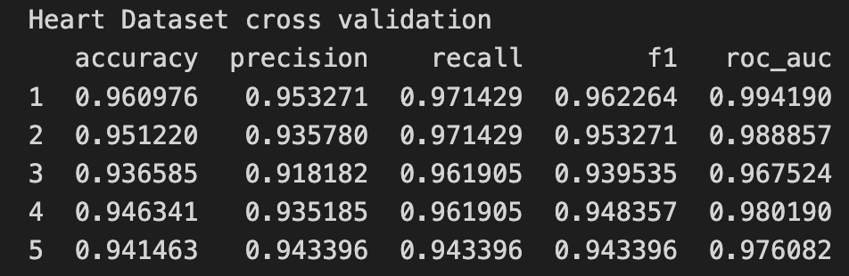
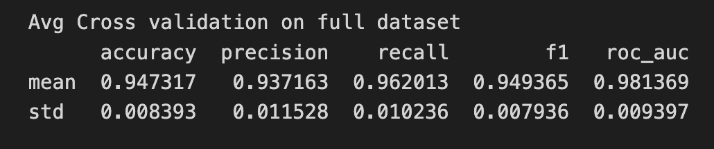
For the K-fold validation results, accuracy ranged from 0.94-0.96, precision from 0.92-0.95, recall  from 0.94-0.97, f1  from 0.94-0.96, and ROC-AUC  from 0.83-0.95. The model performs with an average accuracy of 0.94, precision of 0.94, recall of 0.96, f1 of 0.95, and roc_auc of 0.98. Precision measures the accuracy of positive predictions while recall measures the ability to find all true positive cases. So here, a higher recall than precision indicates that the model minimizes false negatives slightly more than false positives. This is important for heart disease identification. A high rate of false negatives in healthcase and specifically here in heart disease identification have major consequences like lack of treatment for individuals who have heart disease.  The low standard deviation values for all the metrics indicates that the model performs consistently across the different splits of the training dataset. This means that the model is robust and not reliant on a specific subset of the data. It is important to have high and consistent metrics because there is higher standard and smaller margin of error in a healthcare setting.


For the Cancer Genomic K-fold validation results, accuracy ranged from 0.96-1.00, precision  from 0.96-1.00, recall  from 0.96-1.00, f1  from 0.96-1.00, and ROC-AUC  from 0.99-1.00. The model performs with an average accuracy, precision, recall, and f1 of 0.99, while average roc_auc is about 1.00.  The low standard deviation values for the metrics again indicates that the model performs consistently across the different splits of the training dataset. This means that the model is robust and not reliant on a specific subset of the data. These are very high metrics but there was no data leakage that I found. So, the amount of features and high separability of this dataset likely contribute to the observed metrics. 
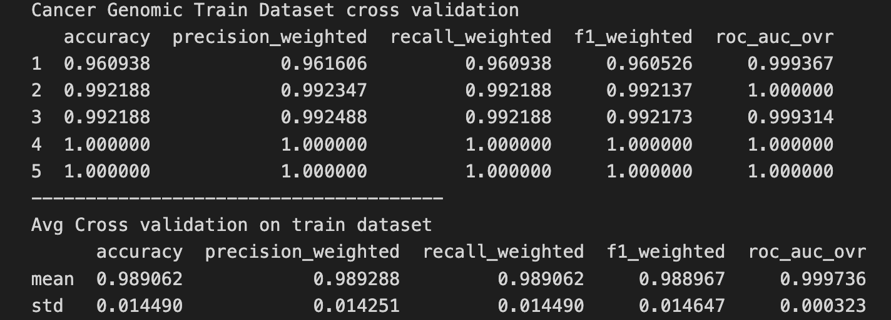


Include figures/tables of cross-validation results for each dataset, and briefly compare:

* Which dataset was easier/harder to classify?

The heart dataset was harder to classify based on the slightly lower average metric values while the cancer genomic dataset was easier to classify. This could be due to the large amount of features in the cancer genomic dataset or the inherent separable nature of the data. 

* Which errors were most common (especially in the cancer dataset)?

Precision was lower for the heart dataset, so there were more false positives, but the model tends to correctly identify positive label. Both precision and recall are very high for the cancer genomic dataset, indicating that few classificiation errors are made overall.  

### 3) Hyperparameter Tuning (Gradient Boosting)
Describe your hyperparameter tuning process and results:

* Which hyperparameters did you explore (e.g., `max_depth`, `n_estimators`, `learning_rate`, etc.)?

I explored max depth, number of estimators, and learning rate. 

* What range of values did you test?

I tested [1, 2, 3, 4, 5] for max depth, [50, 100, 200, 500] for number of estimators, and [0.01, 0.05, 0.1] for learning rate.

* Which configuration performed best on each dataset, and why do you think it worked well?

This was the best hyperparameters configuration for the heart dataset {'learning_rate': 0.1, 'max_depth': 5, 'n_estimators': 500} and the best mean test roc_auc score was 0.9910894925061472. These hyperparameters combined to create a complex model but enough flexibility to prevent overfitting as seen in the high evalution metrics below. If the model was overfitting then the evaluation metrics from the testing set would be low. The high performance indicates that a max depth of 5 adds necessary complexity to the model without overfitting. The learning rate allows the model to learn efficiently while taking meaningful steps to minimize the loss. The 500 estimators allows performance to be boosted and learn well on the training set while maintaing good generalization. I was surpised the model didn't appear to overfit because of the complexity introduced by the max depth size and the number of estimators. Results indicate that this hyperparameter configuration increased model complexity while balancing generalization to create a model that performs excellently on this relatively small dataset. 

* Provide grid search table or plot.
Heart data set:
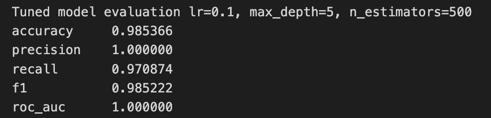
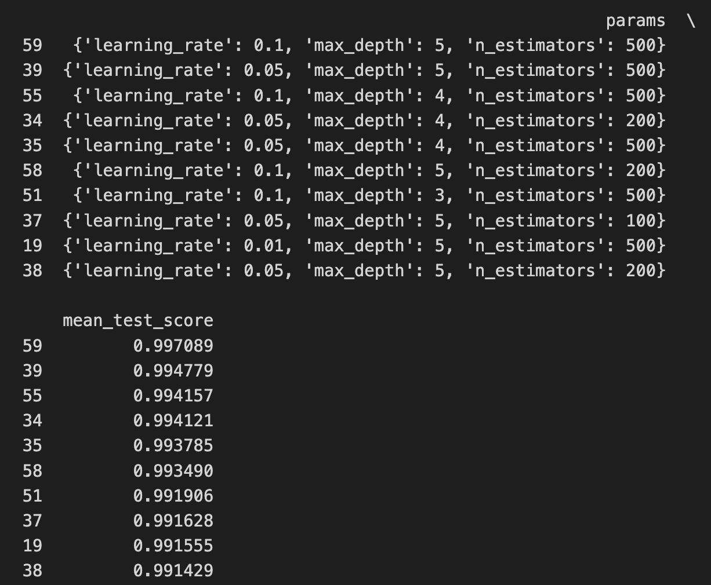


This was the best hyperparameters configuration for the cancer genomic dataset: {'max_depth': 1, 'n_estimators': 50} and the best mean f1 test score was 0.993730. I explored max depth [1, 3] and n_estimators [50, 100]. Since tuning was slightly time consuming, I only explored two options for these hyperparameters. Using f1 as the metric ensured a balance between false positives and false negatives since a high f1 score requires both high precision and high recall. This simple configuration demonstrates the separability of the cancer types in this dataset. A max depth of 1 indicates that each tree is a decision stump and model complexity is further reduced by using only 50 estimators. This indicates that the model does not require boosting to achieve good performance. This simpler configuration both reduces model complexity and prevents overfitting. The configuration selected additionally tells us that the genomic features contain strong signals that help the model distinguish between cancer types eliminating the need for a larger max depth or more estimators.
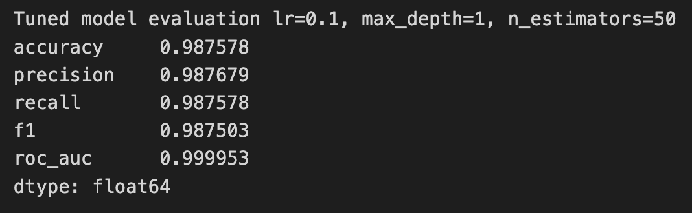
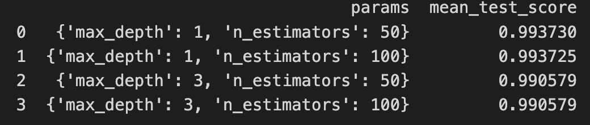

### 4) Feature Importance and Interpretation
Discuss which features were most predictive:

* For gradient boosting: report the top features by importance (and include a figures/table/plot).

The top features for gradient boosting heart dataset are cp (chest pain type), ca (number of major vessels), and thal (myocardial perfusion). 
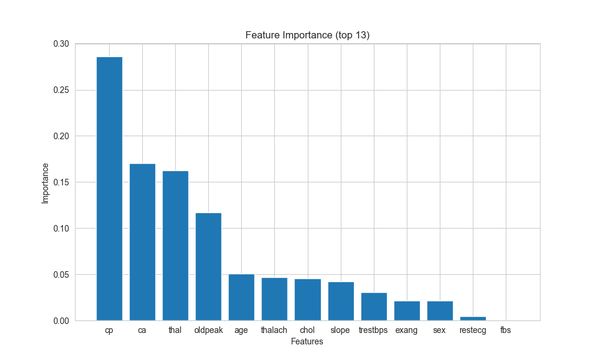

* Compare feature importance to HW1 feature selection (for example: using **Lasso** to identify important features). Do the two methods agree on what features matter most? Why or why not?

HW1 feature selection (cp, sex, and oldpeak) only shares one of the same top 3 features as gradient boosting: chest pain type. The two methods roughly agree on what features matter with slightly different ranking. However, one major discrepancy between the two is the rank of sex. In this homework it is the third least important feature while in HW1 it is the second most important feature. This is likely due to the different nature of nonlinear tree-based methods vs linear methods. In Gradient boosting used in this homework, importance is measured on how splitting reduces Gini impurity while in linear methods in HW1, importance is measure on linear correlation with the target. Chest pain, however, seems to be strongly predictive of the traget regardless of linearity. The figure below demonstrates the importance of chest pain in the gradient boosting classification model. Early splits typically occur on important features, like chest pain type which can been seen as the first split at the root of the tree. This is consistent with the feature importance rankings and additionally serves to demonstrate the different strategies that tree-based vs linear models use features. 
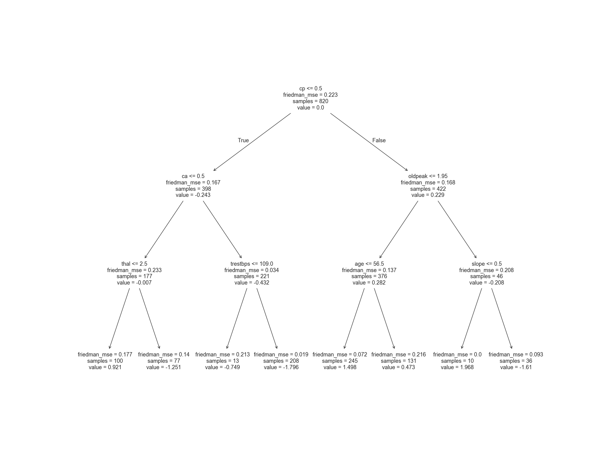

### 5) Comparison to HW1
Using **only the cancer genomics dataset**:

* Select the top-K features based on gradient boosting feature importance.

* Train an HW1 model (e.g., logistic regression or Lasso-based model) using (1) the full feature set and (2) the reduced top-K feature set. 
  - Did the reduced feature set improve or hurt performance?
  - Provide metrics and a short explanation of what you observed.

I used K=2 so the reduced feature set included the top two features which were specifically gene_18746 and gene_12983. The mean accuracy dropped from 1.0 using the entire feature set to 0.782608695652174 when using top-K feature set. This is a decrease of about 0.22, meaning the reduced feature set moderately hurt performance. The model still performs adequately even when using a small subset of available features, suggesting that the top features account for most of the information needed to distinguish between cancer type. The model over predicts class 3, correctly classifying 14 out of 31 class 3 predictions when there are 29 true samples (precison=14/31 = 0.45). Additionally the model struggles with correctly classifying class 3. There were 15 out of 29 instances of true label class 3 samples being misclassified, out of which 4 were predicted as class 1 and 11 were predicted as class 4 (recall = 14/29 = 0.48). This suggests that class 3 and class 4 have similar genomic profiles among the top-K feature set. Class 4 also had low precision (18/30 = 0.60) and recall (18/29 = 0.62). The predictions for the other three classes were more accuate and class 2 had perfect prediction. 

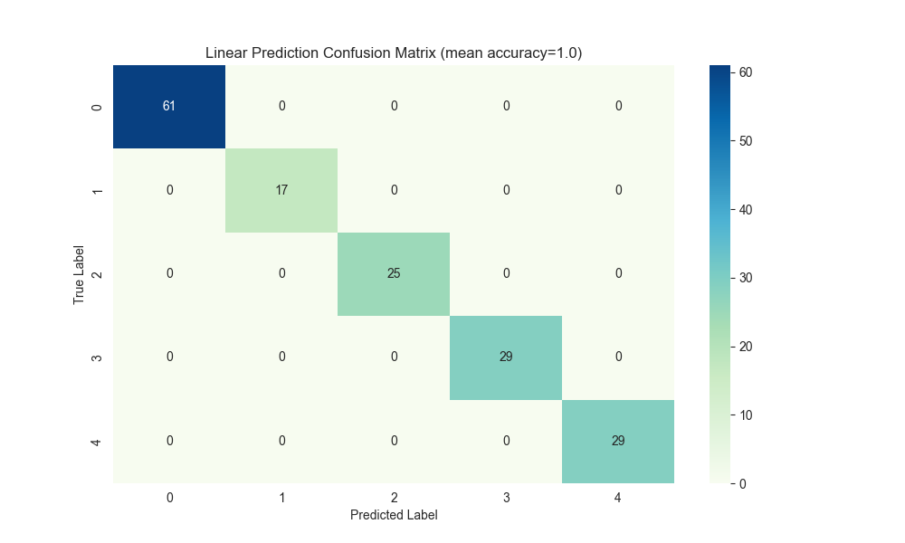
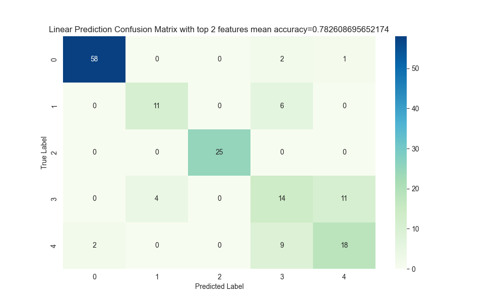

### 6) Discussion
Discuss limitations of your models and results, including model assumptions and generalizability, potential overfitting (especially with deeper trees or large ensembles), sensitivity to hyperparameters, and data quality issues.

One limitation of the model Gradient Boosting methods is the number of hyperparmameters that you can tune. For instance, max depth, number of estimators, learning rate, min samples split (The minimum number of samples required to split an internal node), min samples leaf (The minimum number of samples required to be at a leaf node.), and more. Tuning these hyperparameters can be slow and computationally expensive especially for high dimensional datasets like the cancer genomics dataset. There is also a high tendency to overfit for these types of models especially when max depth and number of estimators is large. When these hyperparmeters are large values, it increases model complexity and gives the model a higher ability to fit noise, resulting in poor generalizability. Additionally these settings increase computational cost, make training slower, and make the model harder to interpret. These types of models are also sensitive to hyperparameters meaning that small changes can affect performance and reduce stability. This dataset has a very large number features of a small number of samples. Models trained on these types of datasets may not generalize well to new sets of data from different patient samples due to variable genomic signals. Additionally, with biological data there are always concerns for data quality such as missing data. While decision trees don't make this assumption, other standard models make i.i.d. assumptions (independent and identically distributed) but in cancer genomic datasets high correlated genomic features would violate this assumption. 

---

## Expected Skills

By the end of this homework, you should be able to:

* Train and evaluate gradient boosting classifiers on biomedical datasets.
* Perform hyperparameter tuning and compare model configurations using cross-validation.
* Interpret feature importance and connect it to feature selection methods from HW1.
* Visualize and interpret model performance using appropriate metrics and plots.
